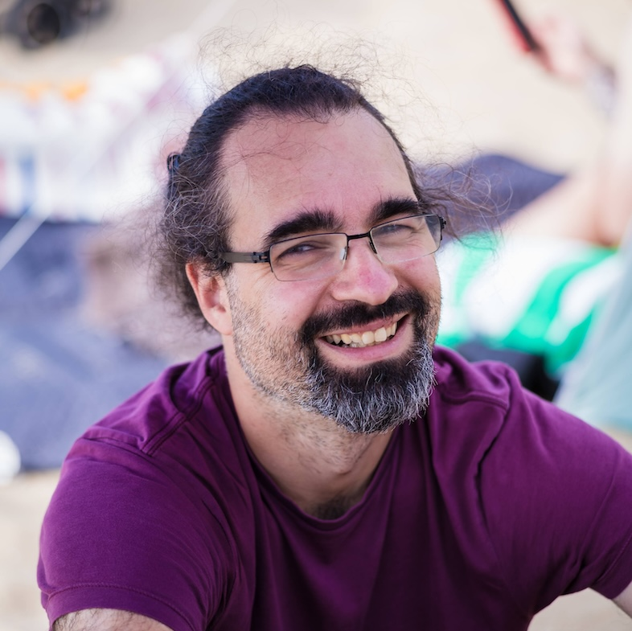

## Research Interests

I'm currently working as a research scientist at Google in Climate & Energy. I'm interested in ocean alkalinity enhancement and related technologies.
I studied Biochemistry and Biotechnology at the University of Bristol and obtained my PhD in Biophysics in 2007. 
I went on to work as a research fellow with Prof. David Baker at the University of Washington to study the protein structure prediction. 
I joined Google in 2012 and worked with Viren Jain on creating a neuron-level map of fly and mouse brain tissue using computer vision and machine learning. 
In 2020 I joined the Climate and Energy team and have been doing research there since with Chris Van Arsdale and John Platt. 

## Research Experience

* Google Exacycle Visiting Faculty Research Fellow (2012-2013) "Objective function parameter optimization for protein folding simulations" and 
  "Flexible backbone design of antibodies"
* Henry Wellcome Research Fellow with Prof. D. Baker, U. of Washington, Seattle (2007-2011) "Massively scalable conformational space search for protein folding prediction" and  "Method development for protein structure prediction with Rosetta@Home"  
* Graduate Research with Prof. A. R. Clarke and Dr. R. B. Sessions, University of Bristol: "Development of novel methods for free-energy calculations" (2002-2006)  
* Worldwide University Network (WUM) fellowship: With Prof. D. Baker, U of Washington “Development of parallel, genetic algorithms for protein structure prediction� (2005)  
* Nuffield Foundation Scholarship: With Prof. A. R. Clarke, U. of Bristol: “Development of computer programs for ab initio protein structure prediction using Monte Carlo based methods� (2002)  
* With Prof. W. Martin, Heinrich Heine Universität, Duesseldorf “Phylogenetic analysis of mitochondrial genes in Arabidopsis thaliana� (2001)

## Selected Publications 

Zhou, Mengyang, Michael Tyka, David Ho, Elizabeth Yankovsky, Scott
Bachman, Thomas Nicholas, Alicia Karspeck, and Matthew Long. 2024b.
“Mapping the Global Variation in the Efficiency of Ocean Alkalinity
Enhancement for Carbon Dioxide Removal.” Nat. Clim. Change. 
[[Preprint]](https://www.researchsquare.com/article/rs-4124909/v1)
[[Interactive]](https://carbonplan.org/research/oae-efficiency)

He, Jing, and Michael D Tyka. 2023. “Limits and Co 2 Equilibration of
Near-Coast Alkalinity Enhancement.” *Biogeosciences* 20 (1): 27–43.
[[Fulltext]](https://bg.copernicus.org/articles/20/27/2023/bg-20-27-2023.html)

Baran, Dror, M Gabriele Pszolla, Gideon D Lapidoth, Christoffer Norn,
Orly Dym, Tamar Unger, Shira Albeck, Michael D Tyka, and Sarel J
Fleishman. 2017. “Principles for Computational Design of Binding
Antibodies.” [*Proceedings of the National Academy of Sciences* 114 (41):
10900–10905.](https://doi.org/10.1073/pnas.1707171114)

Khatib, Firas, Seth Cooper, Michael D Tyka, Kefan Xu, Ilya Makedon,
Zoran Popović, David Baker, and Foldit Players. 2011. “Algorithm
Discovery by Protein Folding Game Players.” [*Proceedings of the National
Academy of Sciences* 108 (47): 18949–53. ](https://www.pnas.org/doi/full/10.1073/pnas.1115898108)
[[PDF]](https://www.pnas.org/doi/epdf/10.1073/pnas.1115898108)

Raman, Srivatsan, Oliver F Lange, Paolo Rossi, Michael Tyka, Xu Wang,
James Aramini, Gaohua Liu, et al. 2010. “NMR Structure Determination for
Larger Proteins Using Backbone-Only Data.” [*Science* 327 (5968): 1014–8.](https://www.science.org/doi/10.1126/science.1183649)
[[PDF]](https://pmc.ncbi.nlm.nih.gov/articles/PMC2909653/pdf/nihms-211856.pdf)

Januszewski, Michał, Jörgen Kornfeld, Peter H Li, Art Pope, Tim Blakely,
Larry Lindsey, Jeremy Maitin-Shepard, Mike Tyka, Winfried Denk, and
Viren Jain. 2018. “High-Precision Automated Reconstruction of Neurons
with Flood-Filling Networks.” [*Nature Methods* 15 (8): 605–10.](https://www.nature.com/articles/s41592-018-0049-4)

## Education 

* PhD, Biochemistry, University of Bristol, with Prof. A. R. Clarke, “Absolute Free Energy Calculations for Biomolecular Systems� (2003-2007)   
* BSc with First Class Honours, Biochemistry with Biotechnology, U. of Bristol (2000 – 2003\)  
* A-Levels (6 'A' grades) in Physics, Chemistry, Biology, Mathematics, General Studies and German; English at GCSE (A), Culford School, Bury St. Edmunds, Suffolk (1998 – 2000\)

## Programming experience

* 2014-2017 Senior Software Engineer and Software Engineering Manager at Google Inc.   
  Full stack, focus on large distributed storage, serving, APIs, Visualization and Machine Learning.  
* 2012-2013  Lead developer of CyrusMol: Interactive scientific supercomputing in the cloud using AppEngine and Google NativeClient (Python/JavaScript/C++) [http://code.google.com/p/cyrusmol](http://code.google.com/p/cyrusmol)  
* 2005-2011 Core developer of the ROSETTA Molecular modelling software (50+ developers, 1.5M line codebase, C++) [https://www.rosettacommons.org/](https://www.rosettacommons.org/)  
* 2003-2007 Lead developer of a flexible molecular mechanics suite with (Python/C++/SWIG, 50k lines) [https://github.com/mtyka/pd](https://github.com/mtyka/pd)   
* Primary programming languages: C++ and Python, Javascript, Typescript and C. Admin of Linux systems. Familiarity with Perl, Java, Fortran, Assembler.   
* Machine learning experience in Tensorflow, focus on Convolutional neural networks for images and generative models. Experienced in NumPy, SciPy, SkLearn.  
* Experienced in developing software for massively parallel computer systems including Google Exacycle, Rosetta@Home/BOINC, Bluegene (64k+ processors) & MPI-based clusters.

## Honors and Awards ##

* Sir Henry Wellcome Postdoctoral Fellowship Grant (2007-2011)  
* Worldwide University Network Exchange Grant (2005)  
* Denton Prize for best final year PhD talk (2005)  
* William Garner Prize for best overall mark in the final degree assessment (BSc) (2003)  
* Fellowship from "Studienstiftung des Deutschen Volkes" (Nat. German Scholarship) (2000-2004)  
* German National Science Competition, 2nd Prize (2001) 

